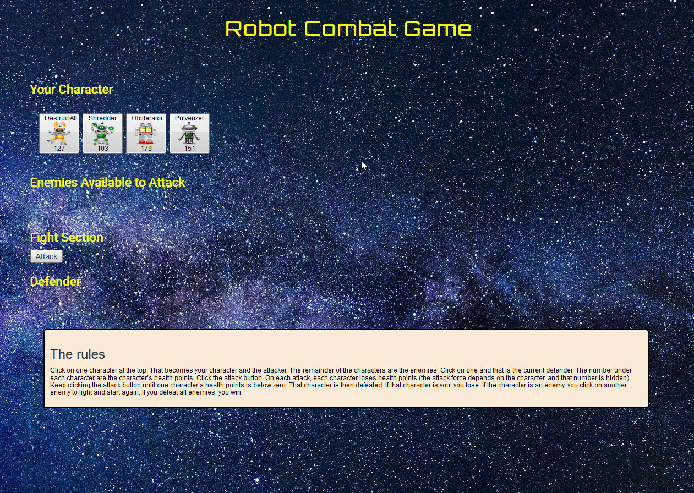

# Robot-Combat-Game
A game with robots fighting.  
Click on one character at the top. That becomes your character and the attacker.  
The remainder of the characters are the enemies. Click on one and that is the current defender.  
The number under each character are the character’s health points.  
Click the attack button.  
On each attack, each character loses health points (the attack force depends on the character, and that number is hidden).   
Keep clicking the attack button until one character’s health points is below zero.   
That character is then defeated. If that character is you, you lose.  
If the character is an enemy, you click on another enemy to fight and start again.  
If you defeat all enemies, you win.  

Demo at: http://joanmarieverba.name/robotgame/  

 

